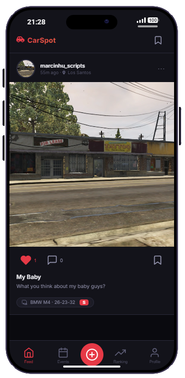
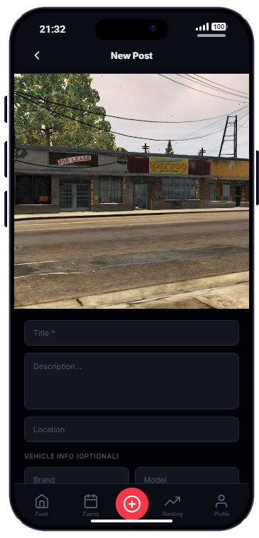
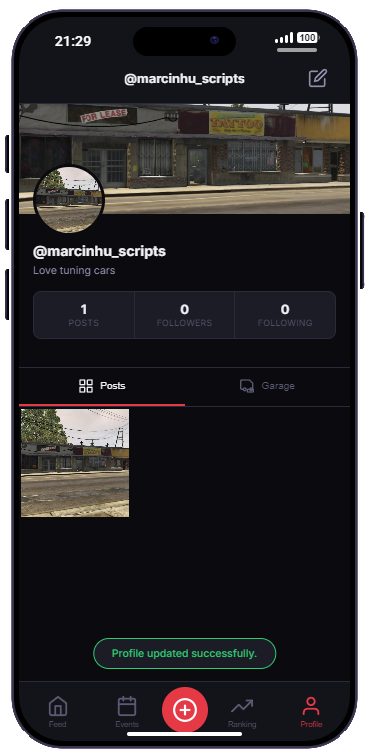
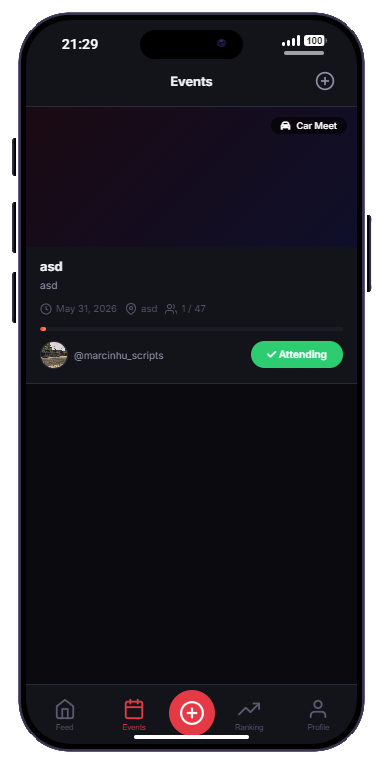
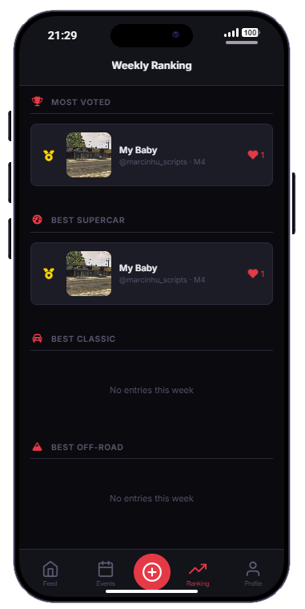

<div align="center">

# CarSpot

**A car social network for LB Phone, share builds, meet up, compete, and show off your garage.**

[](LICENSE)
[](https://docs.lbscripts.com/)
[](https://github.com/marcinhu/lb-phone-carspot/releases)

[Features](#features) · [Screenshots](#screenshots) · [Installation](#installation) · [Configuration](#configuration) · [Support](#support)

</div>

---

## About

**CarSpot** is a free, open-source custom app for [LB Phone](https://docs.lbscripts.com/). It turns the in-game phone into a social platform built around cars — players can post photos of their rides, follow each other, save favourite posts, manage a personal garage, create car meets and events, and compete in weekly rankings.

Designed for roleplay servers that want a lightweight, immersive car culture experience without leaving the phone UI.

---

## Features

| | |
|---|---|
| **Feed** | Infinite-scroll post feed with likes, comments, and saved posts |
| **Posts** | Share photos from the gallery with title, description, location, and full vehicle details (brand, model, plate, class, mods) |
| **Profiles** | Custom username, bio, avatar, cover banner, follower/following counts |
| **Garage** | Showcase vehicles on your profile; import owned vehicles from your framework garage |
| **Events** | Create car meets, drag races, drift nights, and more — with optional phone notifications 5 minutes before start |
| **Ranking** | Weekly leaderboard across most voted, best supercar, best classic, and best off-road |
| **Social** | Follow other players, browse their posts and garage, view post detail with comments |
| **Locales** | Built-in translations: English, Portuguese, Spanish, French, German, Italian |
| **Frameworks** | Auto-detects **QBCore**, **Qbox**, and **ESX** |

---

## Screenshots

<div align="center">

### Feed & posts


&nbsp;&nbsp;


### Profile, events & ranking


&nbsp;&nbsp;

&nbsp;&nbsp;


</div>

---

## Requirements

| Dependency | Required |
|---|---|
| [lb-phone](https://docs.lbscripts.com/) | Yes |
| [oxmysql](https://github.com/overextended/oxmysql) | Yes |
| [ox_lib](https://github.com/overextended/ox_lib) | Yes |
| QBCore / Qbox / ESX | One of these |

---

## Installation

### 1. Download

Clone or download this repository into your resources folder:

```
resources/[lb-phone]/lb-phone-carspot
```

### 2. Database

Tables are created automatically when the resource starts (`carspot.sql` is applied via oxmysql). Manual import is optional — use `carspot.sql` only if you prefer to run it yourself in HeidiSQL/phpMyAdmin.

### 3. Add to server.cfg

Make sure dependencies start **before** CarSpot:

```cfg
ensure oxmysql
ensure ox_lib
ensure lb-phone
ensure lb-phone-carspot
```

### 4. Configure

Open `shared/config.lua` and adjust settings to your liking (see [Configuration](#configuration) below).

### 5. Restart

Restart your server or run:

```
ensure lb-phone-carspot
```

The app will register itself inside LB Phone automatically.

---

## Configuration

All main settings live in `shared/config.lua`:

```lua
Config.Locale = 'en'          -- en | pt | es | fr | de | it
Config.AppName = 'CarSpot'
Config.FeedPageSize = 10
Config.EventReminderMinutes = 5
Config.RankingDays = 7
```

| Setting | Description | Default |
|---|---|---|
| `Config.Locale` | UI and server message language | `'en'`, `'pt'`, `'es'`, `'fr'`, `'de'`, `'it'`|
| `Config.FeedPageSize` | Posts loaded per feed page | `10` |
| `Config.MaxPostTitleLength` | Max characters for post titles | `80` |
| `Config.MaxCommentLength` | Max characters for comments | `200` |
| `Config.DefaultMaxParticipants` | Default event capacity | `50` |
| `Config.EventReminderMinutes` | Phone notification before event | `5` |
| `Config.RankingDays` | Days counted for weekly ranking | `7` |
| `Config.ClassicVehicleClasses` | Classes for classic ranking | `{ 'D', 'C' }` |
| `Config.SupercarVehicleClasses` | Classes for supercar ranking | `{ 'S', 'X' }` |
| `Config.OffroadVehicleClasses` | Classes for off-road ranking | `{ 'offroad', 'SUV', 'O' }` |

Framework detection is automatic — no need to set `Config.Framework` unless you want to override it.

---

## Locales

Translation files are located in `locales/`:

| Code | Language |
|---|---|
| `en` | English |
| `pt` | Portuguese |
| `es` | Spanish |
| `fr` | French |
| `de` | German |
| `it` | Italian |

To add a new language, create `locales/xx.lua` following the same structure as `locales/en.lua` and set `Config.Locale` accordingly.

---

## Project Structure

```
lb-phone-carspot/
├── bridge/framework/     # QBCore & ESX bridge
├── client/               # NUI callbacks & app registration
├── locales/              # Translation files
├── server/               # Database logic & callbacks
├── shared/               # Config, locale helper, bridge
├── ui/                   # Phone app (HTML, CSS, JS)
├── carspot.sql           # Database schema
└── fxmanifest.lua
```

---

## Support

This script is **free and open source**. If you find it useful, a star on GitHub goes a long way.

| | Link |
|---|---|
| Discord | [discord.gg/8cp3UDEeR2](https://discord.gg/8cp3UDEeR2) |
| Store | [marcinhu.tebex.io](https://marcinhu.tebex.io) |
| GitHub | [github.com/marcinhu/lb-phone-carspot](https://github.com/marcinhu/lb-phone-carspot) |

For bugs and feature requests, please open an issue on GitHub or reach out on Discord.

---

## Credits

- Built for [LB Phone](https://docs.lbscripts.com/) by [LB Scripts](https://lbscripts.com/)
- Developed by **[marcinhu](https://marcinhu.tebex.io)**

---

## License

This resource is released **free of charge**. You may use, modify, and redistribute it on your server. Please do not re-upload and sell it as your own work.

<div align="center">

**Made with care for the FiveM car community.**

</div>
